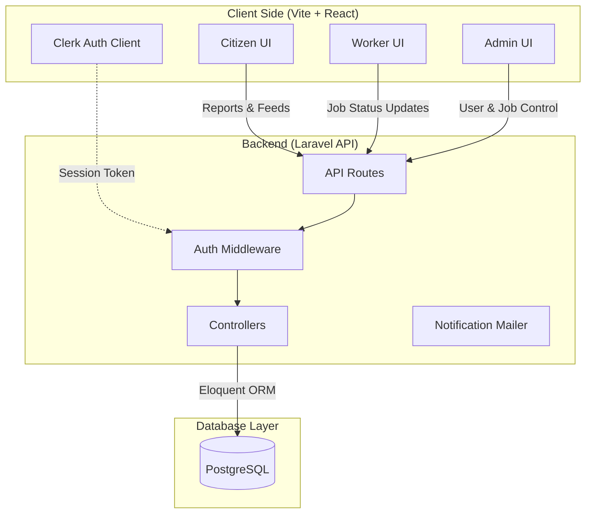
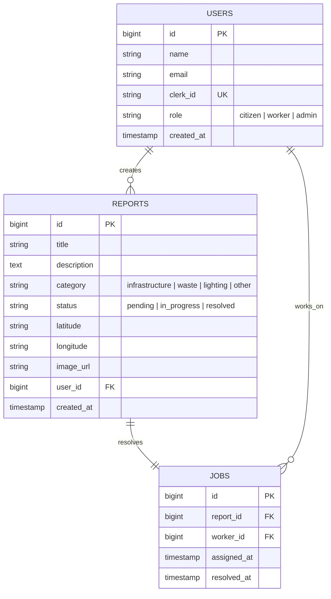

# 🏙️ UrbanFix — Smart City Civic Engagement Platform

[](https://react.dev)
[](https://laravel.com)
[](https://www.postgresql.org)
[](https://tailwindcss.com)
[](https://clerk.com)

**UrbanFix** is a next-generation Smart City application designed to bridge the gap between citizens and municipal authorities. It enables residents to report local issues (potholes, public lighting, waste, vandalism) in real-time, allows city workers to resolve them efficiently, and provides administrators with a comprehensive dashboard to monitor city-wide operations.

---

## 🚀 Key Features & Role-Based Flows

UrbanFix features three distinct portals tailored to different users:

| Citizen Portal 🧑 | City Worker Portal 👷 | Admin Command Center 📊 |
| :--- | :--- | :--- |
| **Interactive Map & Reports**: Explore active civic issues in the neighborhood. | **Assigned Task Manager**: View, track, and update assigned cleanup tasks. | **Live Analytics**: Monitor civic issues reported, resolved, and pending. |
| **Report an Issue**: Smart form to upload images, category, and exact location. | **Progress Reporting**: Update ticket statuses (Pending ➡️ In Progress ➡️ Resolved). | **Worker Allocation**: Assign workers to specific tickets and manage teams. |
| **Personal Dashboard**: Track submitted complaints and status updates in real-time. | **Mobile-Responsive**: Designed to be used on-the-go by maintenance teams. | **Database Moderation**: Edit, delete, and filter tickets or user roles. |

---

## 🏗️ System Architecture



---

## 💾 Database Schema



---

## 🛠️ Tech Stack

- **Frontend**: React 18, Vite, TypeScript, Tailwind CSS, Shadcn/UI, Lucide Icons, React Router.
- **Backend**: Laravel 11, Eloquent ORM, RESTful API Controllers.
- **Authentication**: Clerk Auth (secured JWT token propagation to Laravel).
- **Database**: PostgreSQL (Migrations and Seeders included).

---

## ⚙️ Quick Start Guide

### Prerequisites
- Node.js (v18+)
- PHP (v8.2+) & Composer
- PostgreSQL Database

### 1. Clone & Setup Backend
```bash
cd smartCity-main/Backend/backend
composer install
cp .env.example .env
```
*Configure database credentials and Clerk keys in your `.env` file, then run migrations:*
```bash
php artisan migrate --seed
php artisan serve
```

### 2. Setup Frontend
```bash
cd ../../smartCity-main/UI\ Design
npm install
npm run dev
```

The application will be running locally at `http://localhost:5173`.

---

## ✨ Design Concept & Aesthetics

UrbanFix is designed with a premium, clean aesthetic inspired by modern enterprise dashboards:
- **HSL Tailwind Palettes**: Smooth, accessible slate and indigo accents.
- **Micro-Animations**: Hover-triggered translations and smooth accordion expansions.
- **Responsive Layout**: Designed mobile-first for field workers and desktop-first for city admins.
